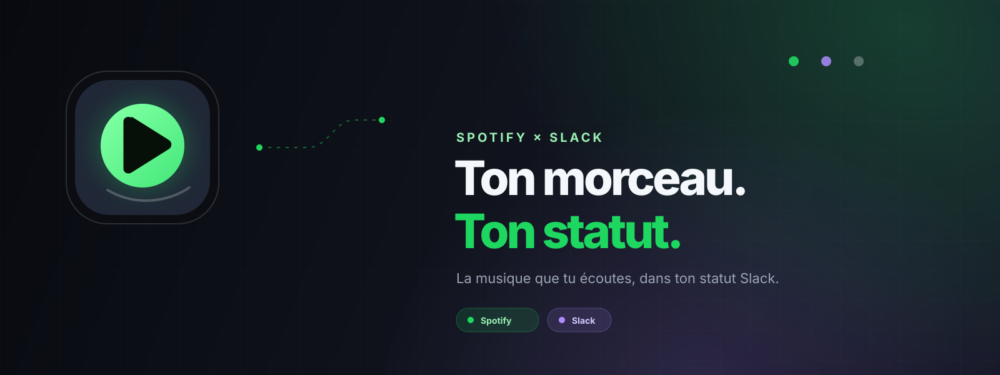

# Spotislack

Spotislack synchronise le morceau Spotify en cours avec le statut personnalisé Slack de chaque utilisateur.

> La musique que tu écoutes, dans ton statut.

Documentation complète : [docs/README.md](docs/README.md).

## MVP inclus

- OAuth Spotify Authorization Code côté serveur avec le scope minimal `user-read-currently-playing`.
- OAuth Slack avec un user token et `users.profile:read,users.profile:write`.
- Tokens stockés dans un petit fichier JSON chiffré AES-256-GCM, adapté à un déploiement Node persistant pour quelques utilisateurs.
- Synchronisation manuelle depuis l’interface, polling de confort toutes les 45 secondes lorsque le tableau de bord est ouvert, et endpoint cron pour une synchronisation même navigateur fermé.
- Support des morceaux et épisodes de podcast, play/pause, appareils Spotify, reconnexion lorsque le refresh token Spotify expire et protection contre l’écrasement d’un statut Slack modifié manuellement.

## Lancer le projet

Prérequis : Node.js 22 ou plus récent.

```bash
npm install
Copy-Item .env.example .env
npm run dev
```

Génère trois secrets longs et remplis-les dans `.env` (`NUXT_SESSION_SECRET`, `NUXT_TOKEN_ENCRYPTION_KEY` et `NUXT_CRON_SECRET`). Pour générer une valeur rapidement :

```bash
node -e "console.log(require('node:crypto').randomBytes(32).toString('base64url'))"
```

## Configurer Spotify

Dans le [Spotify Developer Dashboard](https://developer.spotify.com/dashboard), crée une application Web API et configure :

```text
http://localhost:3000/api/auth/spotify/callback
```

Le compte propriétaire doit avoir Spotify Premium pour une app en Development Mode. Spotify limite alors l’app à cinq utilisateurs autorisés : ajoute chaque email dans Users Management.

## Configurer Slack

Crée une Slack App, ouvre OAuth & Permissions et ajoute :

```text
User Token Scopes:
users.profile:read
users.profile:write
```

Ajoute ensuite la même URL de callback :

```text
http://localhost:3000/api/auth/slack/callback
```

Renseigne le Client ID et le Client Secret dans `.env`. En production, utilise une URL HTTPS publique et recopie exactement les deux callbacks chez Spotify et Slack.

## Synchronisation automatique

Le serveur expose `GET /api/cron/sync`. Protège l’appel avec le header suivant :

```text
Authorization: Bearer <NUXT_CRON_SECRET>
```

Configure un cron externe toutes les 60 secondes, ou appelle cette route depuis un processus cron de ton hébergeur. Le fichier de stockage doit rester sur un volume persistant : un filesystem éphémère de serverless ne convient pas au MVP.

## Vérifications

```bash
npm run typecheck
npm test
npm run build
```

## Évolution multi-instance

Le store JSON est volontairement simple pour l’usage personnel et les cinq comptes autorisés par Spotify. Pour plusieurs instances Nuxt ou un hébergement serverless, remplace `server/utils/store.ts` par un adaptateur Postgres/Supabase chiffrant les mêmes champs ; le reste de l’intégration reste inchangé.
